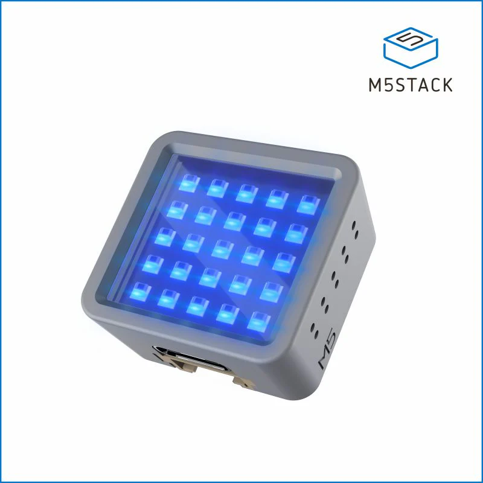
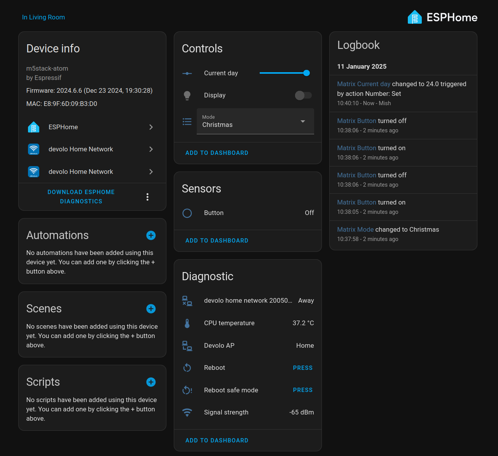

# Advent LEDs

Count up to Christmas with an LED matrix grid!

**Watch the demo video:** <https://www.youtube.com/watch?v=WPg5SP1ItTo>

## Project description

I wanted a tech-y way to display the days left until Christmas, so I decided to use an **M5Stack Atom Matrix** with its built-in 5*5 LED matrix to display the 25 days of December in the run-up to Christmas.

## Technical details

### Hardware

<a href="https://shop.m5stack.com/products/atom-matrix-esp32-development-kit">
  
</a>

I used an ATOM Matrix from M5Stack, which is a small, cuboid development board for the ESP32 processor (specifically, a ESP32-PICO-D4), and it has an LED matrix built in. It has 25 LEDs, which is obviously perfect for an Advent counter!

### Control

The LED matrix has an embedded pushbutton, which you can press to turn the display on or off.

### Software

I used the ESPHome framework for this project, which let me easily configure things like connecting to WiFi (for Home Assistant, see below) and flashing the firmware to the microcontroller. It also had support for the Atom's LED matrix using its `fastled_clockless` and `addressable_light` components.

To actually control the display, I wrote some of my own code in C++ using ESPHome's "lambda" feature, which was my first time making anything using C++ (and I forgot semicolons more times than I could count).

Here's the code that actually draws the pixels to the screen:

```cpp
it.fill(COLOR_OFF);
Color red = Color(0xFF0000);
Color green = Color(0x00FF00);
auto time = id(time_now).now();
int day = time.day_of_month;
// int day = id(day_override).state;
if (day == 0 || time.year == 1970) {
  // Hack: If the year is 1970, we probably just haven't got a time from Home Assistant yet
  it.filled_rectangle(0, 0, 5, 5, red);
  return;
}
Color color = green;
// Draw filled rows
int full_rows = (day - 1) / 5; // Subtract 1 from `day` to account for the blinky pixel
it.filled_rectangle(0, 0, 5, full_rows, color);
// Draw the solid pixels for the bottom row
int remaining_pixels = (day - 1) % 5; // Again, excluding the blinky pixel
int solid_pixels = remaining_pixels - 1;
if (remaining_pixels >= 0) {
  it.filled_rectangle(0, full_rows, remaining_pixels, 1, color);
}
// Draw the blinky pixel for the bottom row
if (id(current_blink_state)) {
  it.draw_pixel_at(remaining_pixels, full_rows, green);
}
id(current_blink_state) = !id(current_blink_state);
```

I set the display to refresh every 400ms, which matches the rate that I want the blinky LED to blink at. (Confused? Watch the video to see that I mean :D)

### Home Assistant integration

As is customary for ESPHome projects, this project integrates with Home Assistant.



The main thing it gets from connecting to Home Assistant is a source for the current time, although it could be modified to use an NTP source if you don't want the dependency on Home Assistant.

It also reports the standard diagnostic data to Home Assistant (CPU temperature, WiFi signal strength, button to remotely reboot it), and I used it during testing to manually override the day of the month that it will show on its matrix.

### Power consumption

Based on my crude measurements from a USB charging station, the device draws 0.2 watts of power at idle (whether the display is on or off), going up to 0.3 watts when it's connecting to WiFi.