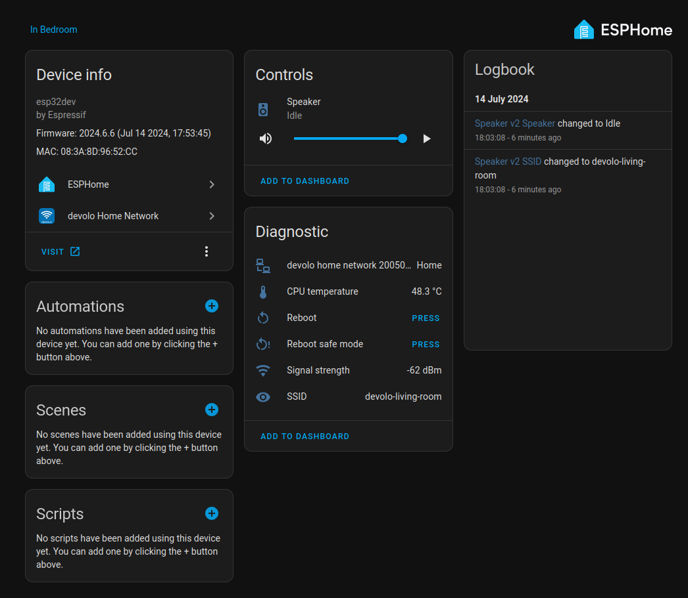
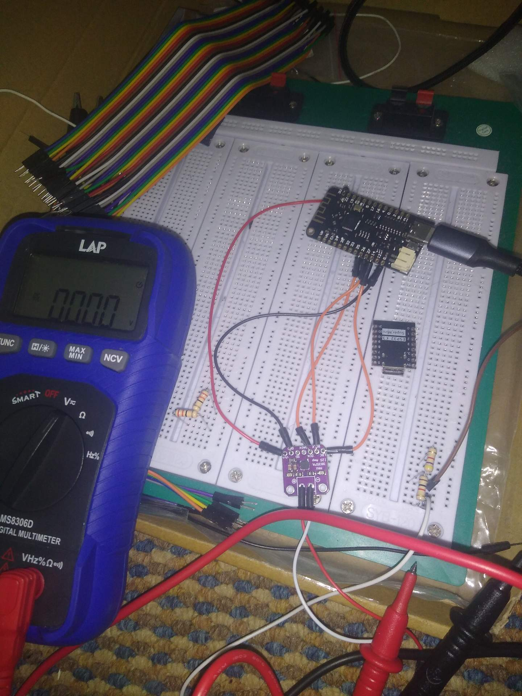

# 2024-07-14

Instructions for flashing the TZT Lite board under Arch Linux

1. `sudo pacman -S linux-headers`
2. Install `i2c-ch341-dkms` from the AUR
3. Reboot
4. Profit

## Photos

### Before

### After

### Debugging

* I verified that the I2S amp was receiving power
* I verified that there was some voltage on the two clock pins
* I verified that there was some voltage (that varied a bit) on the digital in pin when something is played, and 0 V when nothing is being played
* Despite this, the voltage difference between the +ve and -ve output pins remained 0
* I cross-checked my pin connections with guides for my amplifier, and I haven't missed anything as far as I can tell

