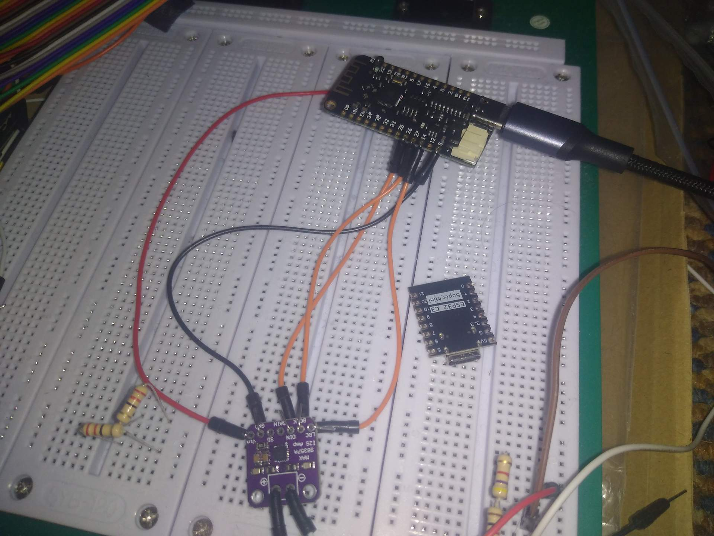

# 2024-07-14

Instructions for flashing the TZT Lite board under Arch Linux

1. `sudo pacman -S linux-headers`
2. Install `i2c-ch341-dkms` from the AUR
3. Reboot
4. Profit

## Photos

Before:

After:

